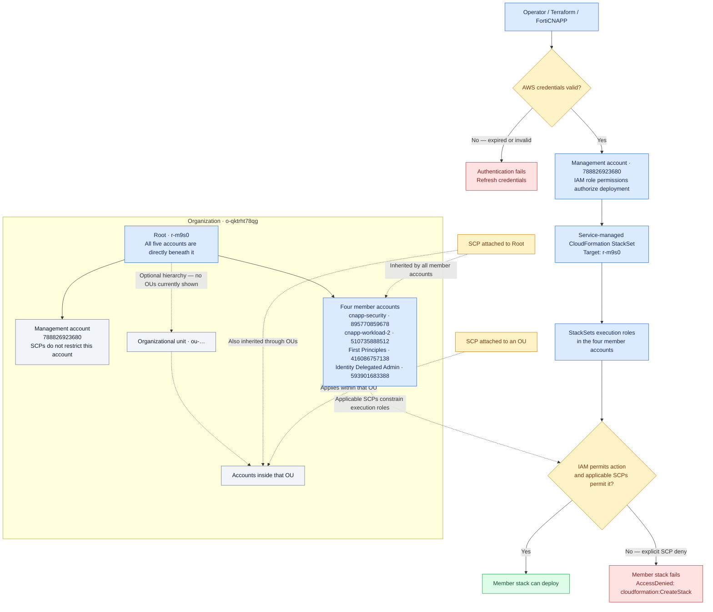

# AWS organization: authentication, deployment, and SCPs

Authentication establishes **who is making the request**. IAM permissions and SCPs determine **whether the requested action is allowed**. Selecting the organization root as a deployment target does not bypass permissions.

## What happened in this deployment

| Check | Observed result |
| --- | --- |
| Authentication | The deployment reached AWS and attempted member-account stack creation. |
| Organization targeting | The StackSet targeted the four member accounts under `r-m9s0`. |
| Member-account authorization | The region restriction SCP `p-eyznnlju` explicitly denied `cloudformation:CreateStack` in `us-east-1`. |
| Management-account deployment | It could succeed because SCPs do not restrict the management account; IAM permissions still apply. |
| Overall verification | Check every expected StackSet instance. A top-level success alone does not establish coverage of every account. |

The SCP failure above describes the earlier deployment. The policy was subsequently reported deleted; a new deployment must be checked for its current result.

**AdministratorAccess cannot override an explicit SCP deny.** SCPs limit permissions; they do not grant credentials or permissions. SCPs can also be attached directly to member accounts. Service-managed StackSets do not deploy stack instances to the management account, so management-account resources require separate deployment.
