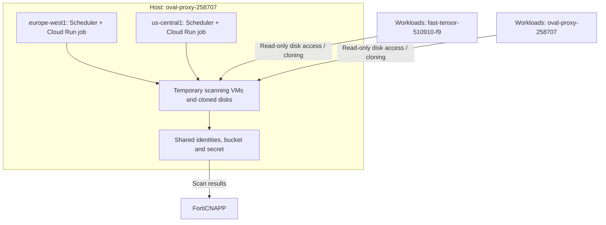

# ☁️ GCP: Agentless Workload Scanning (AWLS)

Deploy FortiCNAPP Agentless Workload Scanning in one Google Cloud host project, then scan eligible workloads in one or more monitored projects and regions. This tutorial uses the CLI and Terraform, with a worked example from a two-project, two-region deployment.

**The scanner's home and its scan targets are different inputs.** A host project holds scanning infrastructure. Monitored projects hold the original workloads. One host can serve multiple monitored projects.

Primary reference: [Lacework GCP agentless Terraform module](https://github.com/lacework/terraform-gcp-agentless-scanning). The resource-placement explanation was checked against [version 2.1.8](https://github.com/lacework/terraform-gcp-agentless-scanning/tree/v2.1.8), used in the example deployment. Verify the plan for your installed version.

## 1. Understand the four deployment choices

| Choice | Question it answers | Example |
|---|---|---|
| **Host / scanning project** | Where will scanning infrastructure and temporary scan resources live? | `oval-proxy-258707` |
| **Monitored projects** | Where are the original workloads to inspect? | `fast-tensor-510910-f9`, `oval-proxy-258707` |
| **Scanning regions** | Where will regional orchestration run? | `europe-west1`, `us-central1` |
| **Integration scope** | Do we grant access individually to projects or through an organization? | `PROJECT` in this example |

The host can also be a monitored project. Here, `oval-proxy-258707` does both jobs. If the host contained only scanner infrastructure, you could select different workload projects instead.

### Host project, billing account, and quota project

| Term | Meaning |
|---|---|
| Host project | Owns scanner resources; its linked billing account pays for those resources. |
| Billing account | Payment account linked to a project. It is not a scanner deployment location. |
| API quota/consumer project | Project charged quota for API requests. A stale quota-project setting can cause permission errors referring to a different project. |
| Cloud Shell selected project | Default for commands without an explicit project. It does not override explicit Terraform provider project settings. |

Choose a billing-enabled host where you can deploy resources. Fortinet recommends a separate scanning project; this lab also selects the host as a workload target. Sharing a billing account does not automatically grant access to other projects.

## 2. Global versus regional: the distinction that matters

**Global means shared once per AWLS integration. It does not mean all geographical regions.**

| Module setting | Creates | Placement |
|---|---|---|
| `global = true` | Shared identities, bucket, secret, IAM configuration, FortiCNAPP integration | Host project; bucket and secret replica use the global module's provider region |
| `regional = true` | Cloud Run orchestration job and Cloud Scheduler job | Host project, selected region |
| Both set to `true` | Shared resources plus the first region's jobs | Same host project |
| `regional = true` plus `global_module_reference` | Another region's jobs, reusing shared configuration | Same host in this example |

The module connected to `google.europe-west1` has `global = true`, so the bucket location and secret replica are `europe-west1`. Service accounts and project IAM bindings are not regional resources.

The second module connects to `google.us-central1` and references the first module. It does not create another shared bucket or another AWLS integration record. The provider association determines shared-resource geography; verify it rather than relying only on CLI input order.

Cloud Scheduler uses a supported replacement region for certain unsupported regions. Both regions in this example support Scheduler. See the [versioned resource definitions](https://github.com/lacework/terraform-gcp-agentless-scanning/blob/v2.1.8/main.tf).

## 3. Worked example: two projects and two regions

These are lab IDs. Substitute your own values when following the tutorial.

| Input | Selection |
|---|---|
| Provisioning project | `oval-proxy-258707` |
| Organization integration | **No** |
| Agentless integration | **Yes** |
| Regions | `europe-west1,us-central1` — no spaces |
| Projects to monitor | `fast-tensor-510910-f9,oval-proxy-258707` |
| Configuration integration | **No** |
| Audit Log integration | **No** |



### What is created, and where?

| Resource | Project | Region/scope | Lifecycle |
|---|---|---|---|
| Orchestration service account | Host | Project identity | Shared deployment resource |
| Scanner service account | Host | Project identity | Shared deployment resource |
| FortiCNAPP integration service account and key | Host | Project identity | Shared deployment resource |
| Results bucket | Host | `europe-west1` | Shared deployment resource; results have configured retention |
| Secret and secret version | Host | Replica in `europe-west1` | Shared deployment resource |
| Cloud Run job | Host | `europe-west1` | Persistent job definition; executions are intermittent |
| Cloud Run job | Host | `us-central1` | Persistent job definition; executions are intermittent |
| Cloud Scheduler jobs | Host | One in each configured region | Scheduled orchestration |
| Host infrastructure roles and bindings | Host | Project scope | Allow creation/cleanup of scanning resources |
| Workload-access custom role and binding | Each selected project; host also receives applicable access | Project scope | Allow discovery and read-only access to workload disks |
| Required API enablement | Host | Project scope | Services needed by scanner infrastructure |
| AWLS integration record | FortiCNAPP | One for the shared deployment | Registers host, scope, filter, credentials, and bucket |
| Temporary scan VMs and disk clones | Host | Applicable scanning zones | Created during scans and cleaned up |

The Terraform apply resource count includes IAM bindings, secrets, and helper resources. It is not the number of scanner VMs. Runtime VMs and clones are orchestrated later, rather than declared individually as permanent Terraform resources.

### What is not deployed by this AWLS-only example?

| Item | Behavior |
|---|---|
| Agent inside original workload VMs | No Linux agent is installed by this workflow. |
| Full scanner stack in every monitored project | Scanner infrastructure remains centralized in the host. Monitored projects receive access roles/bindings. |
| Copies of the original application environment | Workloads remain where they are; disk copies are used for inspection. |
| GKE cluster or Kubernetes DaemonSet | Not provisioned by this workflow. |
| Cloud Run HTTP service | The orchestration resource is a **Job**, even if its name includes `service`. |
| Cloud API Configuration or Audit Log integration | Both were disabled in the wizard. Existing integrations are separate resources. |
| Audit-log sink, Pub/Sub log transport | Not part of this AWLS-only configuration. |
| New workload projects or a new organization | Uses your existing projects and organization context. |
| Custom VPC/subnet | Not selected here. By default the scanner uses the default network; custom networking can be configured separately. |

## 4. The scan process: serverless orchestration plus VM inspection

1. Scheduler invokes the regional Cloud Run job.
2. The job determines whether scanning is due and discovers eligible workloads within the selected scope.
3. It obtains read-only source-disk access and prepares disk clones in the scanning project.
4. Temporary Compute Engine scanner VMs inspect the copied disks.
5. Results are made available to FortiCNAPP; temporary scanning resources are cleaned up.

**Cloud Run coordinates the scan; temporary Compute Engine VMs perform disk inspection.** Agentless does not mean no infrastructure or no cost.

The versioned Terraform Scheduler expression is hourly (`0 * * * *`). The integration's scan frequency can be 24 hours: an hourly orchestration check is not the same as rescanning every workload hourly. Your console's frequency and execution logs determine the actual behavior.

A subnet is needed in the applicable scanning zones. The default networking path uses external IPs; a custom network/subnet path can be used instead. Follow [Fortinet's AWLS prerequisites](https://docs.fortinet.com/document/forticnapp/26.2.0/administration-guide/834193/prerequisites) for networking and outbound connectivity.

## 5. The three AWLS service accounts

Your lab screenshots showed the suffix `fcf2`. Suffixes vary between deployments.

| Lab identity prefix | Role in scanning | Access placement |
|---|---|---|
| `lacework-awls-orchestrate-fcf2` | Cloud Run orchestration; discovers workloads and manages scan resources | Host infrastructure permissions and monitored-scope workload access |
| `lacework-awls-scanner-fcf2` | Identity used by temporary scanner VMs | Host scanner permissions, secret access, results-bucket access |
| `lacework-awls-sa-fcf2` | FortiCNAPP integration identity | Result-object access and module-configured invocation permissions |

The `lw-cfg-16f50be4` identity visible in your screenshot belongs to the earlier Cloud API configuration integration. Its presence does not mean the AWLS-only deployment recreated Configuration integration.

Runtime service-account roles are different from deployment-user roles. For example, Terraform's user needs `iam.serviceAccounts.actAs` to attach an identity to a job. Granting runtime permissions to the service account does not automatically give the deployer that permission.

Verify exact bindings in the [IAM definitions](https://github.com/lacework/terraform-gcp-agentless-scanning/blob/v2.1.8/custom_roles.tf) and the Terraform plan.

## 6. More projects, more regions, or organization scope?

For one host and one shared integration:

| Selected scope | Selected regions | Shared stack | Regional job sets | Access configuration |
|---|---|---|---|---|
| One project | Two | One | Two | Selected project |
| Two projects | Two | One | Two | Both selected projects |
| Three projects | Two | One | Two | All three selected projects |
| Three projects | Three | One | Three | All three selected projects |
| Organization | Two | One | Two | Organization-level inherited access, with applicable filters |

**Three projects × two regions does not mean six full scanner deployments.** It means one shared set and two regional orchestration sets, serving eligible workloads across the selected projects. Runtime scanning VM counts vary with workloads.

Configured regions must cover the workloads you intend to scan. Adding a monitored project with workloads in another region does not add a regional job automatically; add that region explicitly and review supported-region/network requirements.

### Project mode versus organization mode

| Question | Project mode | Organization mode |
|---|---|---|
| Terraform input | `integration_type = "PROJECT"` | `integration_type = "ORGANIZATION"` |
| Access grants | Selected projects individually | Organization role/binding inherited by descendants |
| Project selection | Explicit monitored project list | Organization discovery, constrained by project filters if provided |
| New projects | Add selection and provision access | Can be included when organization permissions, filters, and regional coverage permit |
| Scanner location | Host project | Host project |
| Bucket and regional job architecture | Shared bucket plus regional jobs | Same structure |

Entering `organization_id` alone does not enable organization mode. In the lab, `integration_type` was omitted, defaulted to `PROJECT`, and the FortiCNAPP console confirmed `Integration Level: PROJECT`.

To convert the global module to organization scope:

```hcl
integration_type = "ORGANIZATION"
organization_id  = "900381110656"
```

Keep a project filter to restrict targets, or use an empty list for unrestricted organization project selection:

```hcl
project_filter_list = []
```

Review the plan because changing scope alters integration identity and IAM placement. Do not assume this is a harmless display-label change.

## 7. Prerequisites and deployment permissions

Prepare billing, APIs, regional networking, a FortiCNAPP API key, and an authorized GCP deployer. Use [Fortinet's AWLS deployment-permission reference](https://docs.fortinet.com/document/forticnapp/latest/administration-guide/281711/agentless-workload-scanning-for-google-cloud-iam-permissions-required-for-deployment) for a full custom-role permission set.

The table below explains predefined roles used to resolve this lab's failures. It is not a claim that these are the minimal permissions or a complete permission recipe for every version.

| Deployment operation | Scope | Relevant predefined role |
|---|---|---|
| Enable/use APIs | Host and any explicitly named quota project | Service Usage Admin / Consumer |
| Create identities and keys | Host | Service Account Admin / Key Admin |
| Create and bind project custom roles | Host and monitored projects | Role Administrator / Project IAM Admin |
| Create secrets and their IAM bindings | Host | Secret Manager Admin |
| Create bucket and bucket IAM | Host | Storage Admin |
| Read Compute project metadata | Host | Compute Viewer |
| Create regional Cloud Run jobs | Host | Cloud Run Developer |
| Create Scheduler jobs | Host | Cloud Scheduler Admin |
| Attach orchestration identity | Orchestration service account | Service Account User, granted to deployer |
| Create organization roles/bindings | Organization mode only | Authorized organization role/IAM management permissions |

An existing project IAM administrator must grant the deployer's permissions. Being a domain administrator or an organization administrator does not automatically give all permissions on a project outside that organization.

### Authentication and API quota alignment

```bash
gcloud auth list
gcloud config set project oval-proxy-258707
gcloud config set billing/quota_project oval-proxy-258707
gcloud billing projects describe oval-proxy-258707
```

Confirm the intended identity is active and billing is enabled. If there are no CLI credentials, run `gcloud auth login`. If your Terraform environment needs user Application Default Credentials, run `gcloud auth application-default login` and then:

```bash
gcloud auth application-default set-quota-project oval-proxy-258707
```

CLI login and ADC are distinct. When authorizing ADC, approve Cloud Platform access rather than only profile/email access. Paste verification codes only into the local login prompt. Do not print or commit credential JSON.

The quota project requires `serviceusage.services.use`. An explicit provider `billing_project` with `user_project_override = true` can keep Terraform requests aligned with the host, as used below. See [Google's quota-project guidance](https://docs.cloud.google.com/docs/quotas/set-quota-project).

## 8. Generate with the FortiCNAPP CLI

Install once if needed:

```bash
mkdir -p "$HOME/bin"
curl -fsSL https://raw.githubusercontent.com/lacework/go-sdk/main/cli/install.sh \
  | bash -s -- -d "$HOME/bin"
export PATH="$HOME/bin:$PATH"
lacework version
lacework configure
```

Use a configured FortiCNAPP profile and an authenticated GCP deployment identity. Their credentials serve different systems.

For a new deployment, choose a dedicated output folder. For an existing deployment, preserve its directory and state and do not regenerate it casually.

```bash
mkdir -p "$HOME/lacework/cnapp-awls"
cd "$HOME/lacework/cnapp-awls"
lacework generate cloud-account gcp
```

Answer using the table in Section 3. The CLI may ask for an organization ID even in this project workflow; the generated `integration_type` and plan determine scope. Enter region and project lists without spaces. Choose **No** at the cached-values prompt when generating a genuinely new configuration with changed settings.

## 9. Terraform example: the complete deployment layout

Use this as a fresh-deployment example after substituting your project IDs. For an existing deployment, preserve module names to avoid unintended Terraform address changes.

```hcl
terraform {
  required_version = ">= 1.5"

  required_providers {
    google = {
      source  = "hashicorp/google"
      version = ">= 4.46"
    }
    lacework = {
      source  = "lacework/lacework"
      version = "~> 2.0"
    }
  }
}

provider "google" {
  alias                 = "europe-west1"
  project               = "oval-proxy-258707"
  region                = "europe-west1"
  billing_project       = "oval-proxy-258707"
  user_project_override = true
}

provider "google" {
  alias                 = "us-central1"
  project               = "oval-proxy-258707"
  region                = "us-central1"
  billing_project       = "oval-proxy-258707"
  user_project_override = true
}

provider "lacework" {
  profile = "onboarding"
}

module "lacework_gcp_agentless_scanning_global" {
  source  = "lacework/agentless-scanning/gcp"
  version = "2.1.8"

  global           = true
  regional         = true
  integration_type = "PROJECT"
  organization_id  = "900381110656"

  project_filter_list = [
    "fast-tensor-510910-f9",
    "oval-proxy-258707"
  ]

  providers = {
    google = google.europe-west1
  }
}

module "lacework_gcp_agentless_scanning_region_us-central1" {
  source  = "lacework/agentless-scanning/gcp"
  version = "2.1.8"

  regional                = true
  global_module_reference = module.lacework_gcp_agentless_scanning_global

  providers = {
    google = google.us-central1
  }
}
```

This example pins the module version used by the lab. The original generated `~> 2.0` permits later 2.x module versions. Review provider/module changes before upgrading and retain `.terraform.lock.hcl` for provider reproducibility.

Deploy:

```bash
terraform init
terraform fmt
terraform validate
terraform plan
terraform apply
```

Confirm host, target projects, regions, IAM scope, and planned deletions before approval. A partial plan followed by an error is not a valid completed plan. A resource's `Creation complete` message is not a completed deployment; wait for final `Apply complete!`.

## 10. Validate resources and collection

The lab screenshots confirmed the following in `oval-proxy-258707`. These are observed names, not hardcoded names to reuse:

| GCP console page | Observed resource | What it confirms |
|---|---|---|
| Cloud Run → Jobs | `lacework-awls-service-fcf2` in both regions | Two regional job definitions; the same name is valid in different regions |
| Cloud Storage → Buckets | `lacework-awls-bucket-fcf2`, `europe-west1` | One shared results bucket in Europe |
| Secret Manager → Secrets | `lacework-awls-secret-fcf2`, location `europe-west1` | Shared secret with Europe replica |
| IAM & Admin | `orchestrate`, `scanner`, and `sa` identities with suffix `fcf2` | Three identities with distinct purposes |

Check from CLI:

```bash
gcloud run jobs list --project=oval-proxy-258707 --region=europe-west1
gcloud run jobs list --project=oval-proxy-258707 --region=us-central1
gcloud scheduler jobs list --project=oval-proxy-258707 --location=europe-west1
gcloud scheduler jobs list --project=oval-proxy-258707 --location=us-central1
gcloud storage buckets list --project=oval-proxy-258707
gcloud secrets list --project=oval-proxy-258707
gcloud iam service-accounts list --project=oval-proxy-258707
lacework cloud-account list
```

For authoritative Terraform bucket placement:

```bash
terraform state show \
  'module.lacework_gcp_agentless_scanning_global.google_storage_bucket.lacework_bucket[0]'
```

Check its `name`, `project`, and `location`. Do not paste the full state or secret/key resources into chat or GitHub.

In FortiCNAPP, verify **Integration Level**, **Scanning Project**, **Shared Bucket**, **Limit Projects**, and scan frequency. In PROJECT mode, the integration can be displayed under its host project even though the target list contains several workload projects.

Provisioning success and scanning success are separate checks. Review Cloud Run executions/logs, Scheduler delivery, and FortiCNAPP scan results. An enabled integration or green job-deployment indicator alone does not prove that every selected workload has been scanned. `Integration Pending` needs collection/execution verification.

## 11. Troubleshooting and retries

| Symptom | Action |
|---|---|
| Alias/module name includes ` us-central1` | Remove the leading space; use comma-separated input without spaces. |
| `USER_PROJECT_DENIED` mentions another project | Align provider quota project and credentials; check `serviceusage.services.use` on the consumer project. |
| `iam.roles.get` fails on a monitored project | Have that project's IAM administrator grant deployment custom-role access; organization administration alone may not cover it. |
| `run.jobs.create` denied | Grant the deployer Cloud Run deployment permissions in the host. |
| `iam.serviceAccounts.actAs` denied | Grant the deployer Service Account User on the named orchestration identity. |
| Secret/bucket/Scheduler creation denied | Correct deployment permissions on the host project. |
| Key creation or domain-policy rejection | Inspect the exact organization constraint and actual resource owner; use an approved scoped policy change rather than blanket relaxation. |
| Terraform partly succeeded | Correct the prerequisite and rerun plan/apply in the same directory/state. |
| Old bucket appears in another console project | Compare exact names, creation dates, project IDs, and Terraform state; unrelated old buckets are not evidence of misplaced AWLS resources. |

Grant permissions using an identity that already administers the affected resource. After a successful IAM change, allow propagation and retry. Do not grant service-agent roles to your deployment user.

## 12. Costs, state, and cleanup

Scanner jobs, temporary VMs/disks, storage, secrets, and data movement can generate charges. Adding targets increases potential scanning work even when the count of persistent regional jobs stays unchanged. Shared results reside in the selected bucket region, so this design is not a guarantee that every data path stays within each workload's region.

Keep API keys, service-account private keys, secret values, saved plans, and Terraform state out of GitHub. State can contain credentials. Store it securely and preserve it for future maintenance.

```gitignore
.terraform/
*.tfstate
*.tfstate.*
*.tfplan
tfplan.json
.lacework.toml
credentials.json
service-account-key.json
```

To retire this deployment, use its original directory and credentials:

```bash
terraform plan -destroy
terraform destroy
```

Review the deletion plan. The module can force-delete a nonempty results bucket, so scan results can be removed. Deleting local Terraform files or the CLI executable does not remove deployed resources. Deleting only the FortiCNAPP UI record does not clean up GCP infrastructure. Check for remaining runtime resources after retirement.

## References

- [Terraform module and examples](https://github.com/lacework/terraform-gcp-agentless-scanning)
- [Version 2.1.8 resource implementation](https://github.com/lacework/terraform-gcp-agentless-scanning/blob/v2.1.8/main.tf)
- [Version 2.1.8 custom-role implementation](https://github.com/lacework/terraform-gcp-agentless-scanning/blob/v2.1.8/custom_roles.tf)
- [AWLS networking and scanning prerequisites](https://docs.fortinet.com/document/forticnapp/26.2.0/administration-guide/834193/prerequisites)
- [AWLS deployment IAM permissions](https://docs.fortinet.com/document/forticnapp/latest/administration-guide/281711/agentless-workload-scanning-for-google-cloud-iam-permissions-required-for-deployment)
- [FortiCNAPP CLI setup](https://docs.fortinet.com/document/forticnapp/latest/cli-reference/68020/get-started-with-the-forticnapp-cli)
- [Google API quota project setup](https://docs.cloud.google.com/docs/quotas/set-quota-project)
