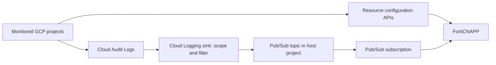

# ☁️ GCP: Cloud API Integration

Connect Google Cloud to FortiCNAPP for cloud configuration visibility and audit-log analysis. This guide follows **Guided Configuration** for a single project or one organization, then shows the **FortiCNAPP CLI** for an explicit list of projects.

The CLI executable and some resource labels still use the name `lacework`.

## 🧾 Onboarding requirements

| Requirement | Why it matters | Reference |
|---|---|---|
| FortiCNAPP administrator | Create the API key and cloud integrations. | [Create an API key](https://docs.fortinet.com/document/forticnapp/latest/cli-reference/68020/get-started-with-the-forticnapp-cli#create-api-key) |
| GCP deployment identity | Authorize Terraform to create resources and assign IAM roles. | [Required roles](https://docs.fortinet.com/document/forticnapp/latest/administration-guide/102752/required-roles-for-google-cloud-configuration-and-audit-log-integrations#least-privilege-access) |
| Billing-enabled host project | Holds the integration's service account and Pub/Sub resources. | [GCP integration prerequisites](https://docs.fortinet.com/document/forticnapp/latest/administration-guide/526645/google-cloud-integration-guided-configuration) |
| Google Cloud Shell or Terraform-supported host | Runs the generated bundle or CLI deployment. | [Guided Configuration](https://docs.fortinet.com/document/forticnapp/latest/administration-guide/526645/google-cloud-integration-guided-configuration) |
| Required APIs enabled | Allows the integration to discover resources and collect metadata. | [Required Google Cloud APIs](https://docs.fortinet.com/document/forticnapp/latest/administration-guide/342519/enable-the-required-google-cloud-apis) |

## 🧠 Why Cloud API integration?

Two data paths provide different kinds of visibility:

| Integration | Question it answers | Data path | Example |
|---|---|---|---|
| **Configuration / CSPM** | How are resources and access configured? | FortiCNAPP service account → GCP resource APIs → configuration assessment | Find a publicly accessible bucket or an overly broad IAM binding. |
| **Audit Log / activity analysis** | Who performed which action, on what resource, and when? | Cloud Audit Logs → Cloud Logging sink → Pub/Sub → FortiCNAPP | Investigate an IAM change or unexpected administrative activity. |

IAM configuration supplies identity and permission context. Audit events add observed activity for correlation. Available identity-risk and threat-detection views depend on your FortiCNAPP capabilities and the data collected; this tutorial does not deploy a separate CIEM resource in GCP.

This Cloud API workflow does not install a Linux agent, Kubernetes DaemonSet, or agentless workload scanner. Those are separate integrations.

### GCP terms in plain language

| Term | Meaning in this tutorial |
|---|---|
| **Organization** | The top of your managed GCP resource hierarchy, such as `example.com`. It has a numeric organization ID. |
| **Project** | A container for GCP resources, APIs, IAM bindings, and billing association. Use the project **ID**, not its display name or numeric project number, in the Guided project field. |
| **Host project** | The project used to provision FortiCNAPP integration resources. A dedicated host is useful for an organization integration. |
| **Monitored scope** | The project, projects, or organization whose configuration and events you want FortiCNAPP to assess. |
| **Service account** | A non-human GCP identity used by FortiCNAPP to read metadata and consume audit messages. |
| **IAM role / binding** | A role bundles permissions; a binding gives that role to a user, group, or service account at a resource scope. |
| **Cloud Audit Logs** | Records of GCP API activity, including administrative and data-access events where enabled. |
| **Log Router / log sink** | Cloud Logging's routing mechanism. A sink selects logs using a filter and sends matching entries to a destination. |
| **Pub/Sub topic** | The destination where the sink publishes audit-log messages. |
| **Pub/Sub subscription** | A delivery queue attached to the topic. FortiCNAPP reads and acknowledges messages through its subscription. |
| **Sink writer identity** | The identity Cloud Logging uses to publish logs to the topic. It needs destination write permission. |
| **FortiCNAPP API key** | Authenticates the deployment to FortiCNAPP. It is separate from GCP credentials and service-account keys. |
| **Terraform** | Provisions the resources and tracks them in state so changes and retries can be reconciled. |

### What is a log sink?

Think of a sink as a **routing rule**: “Take logs matching this filter and send them to this Pub/Sub topic.” It does not store the logs itself. In this workflow, Pub/Sub buffers messages for FortiCNAPP to consume.

A project sink covers that project's logs. An organization **aggregated sink**, configured to include children, can collect matching logs from descendant projects into a central topic. The topic can reside in the host project even though the sink belongs to the organization.

The **sink writer** publishes messages; the **FortiCNAPP service account** consumes them. Check both sides of the IAM configuration when troubleshooting. See [Google's log routing guide](https://docs.cloud.google.com/logging/docs/export/configure_export_v2) and [aggregated sinks](https://docs.cloud.google.com/logging/docs/export/aggregated_sinks).



> A sink forwards logs that actually exist. Data Access audit logs are disabled by default for most services, with BigQuery exceptions. Enable the required categories deliberately; additional log volume can incur costs. Creating a sink does not itself enable missing Data Access logs. See [Google's Data Access audit-log guidance](https://docs.cloud.google.com/logging/docs/audit/configure-data-access).

## 🧱 What will be deployed?

For a new **Configuration + Pub/Sub Audit Log** integration, expect the following. Existing-resource options can change the plan; review the generated Terraform for the exact names, count, permissions, and scope.

| Resource or change | Location | Purpose |
|---|---|---|
| Service account and, in this key-based workflow, a service-account key | Host project | Authenticate ongoing GCP collection. A service account may be shared between Configuration and Audit Log modules. |
| Configuration reader roles and custom role | Monitored project(s) or organization | Allow resource discovery and metadata/security-policy reads. Organization bindings can be inherited by descendant projects. |
| Pub/Sub topic and subscription | Host project | Transport audit entries and deliver them to FortiCNAPP. |
| Project sink(s) or organization aggregated sink | Monitored scope | Route matching audit logs to the topic. An existing sink may be reused instead. |
| Topic/subscription IAM bindings | Pub/Sub resources | Let the sink publish and the integration consume messages. |
| API enablement | Projects specified by the modules | Make required GCP API services available. |
| Configuration and Audit Log integration records | FortiCNAPP tenant | Register collection settings and credentials with FortiCNAPP. |
| Terraform state and generated files | Deployment environment | Track resources for maintenance and retries. State can contain private keys. |

A Pub/Sub-based integration does not require the legacy Cloud Storage log-bucket transport. Enabling Compute Engine or Kubernetes Engine APIs does not create VMs or GKE clusters.

## ⚙️ Choose deployment scope

| What you want to monitor | Workflow used here | Scope selection |
|---|---|---|
| One project | Guided Configuration or CLI | Organization option off; select the project. |
| One organization and its descendant projects | Guided Configuration or CLI | Organization option on; supply its numeric ID and a host project. |
| Several explicitly selected projects | CLI | Organization option off; supply a comma-separated project list. |

An organization integration already covers multiple projects within its configured scope. An explicit multi-project deployment is useful when choosing individual projects, including projects that do not share an organization. Using CLI for that workflow is this tutorial's choice, rather than a claim that all other methods are unsupported.

The host project and monitored scope are different inputs. Sharing a billing account does not make projects members of the same organization. The Cloud Shell prompt and output-directory name also do not override the host project in generated Terraform.

## 🔑 Prepare GCP credentials and billing


Use Google Cloud Shell with the identity that will deploy the integration. Check its credentials:

```bash
gcloud auth list
```

If no valid account is available, authenticate:

```bash
gcloud auth login
```

Signing in to the browser or running `gcloud config set account` alone does not obtain missing CLI credentials. Separate Cloud Shell sessions can have different authenticated accounts.

Set your actual host project ID:

```bash
export CNAPP_HOST_PROJECT="YOUR_HOST_PROJECT_ID"
gcloud config set project "$CNAPP_HOST_PROJECT"
gcloud billing projects describe "$CNAPP_HOST_PROJECT"
```

Confirm `billingEnabled: true`. For multiple-project deployments, check billing on each selected project too, because the generated modules can enable APIs there. An account merely being linked does not mean billing is active.

To link a project to an existing active billing account:

```bash
gcloud billing projects link "$CNAPP_HOST_PROJECT" \
  --billing-account=YOUR_BILLING_ACCOUNT_ID
```

The deploying identity needs project billing-assignment access and Billing Account User access on the destination account. A billing account can pay for a project without belonging to the same organization. Billing links do not change a project's organization. See [Google Cloud billing](https://docs.cloud.google.com/billing/docs/concepts).

### Deployment permissions: Owner or least privilege

These roles belong to the **identity running deployment**, not automatically to the service account used for ongoing collection.

For the host project and a project-level deployment, Fortinet documents Owner as a setup option, or the following narrower deployment roles. For multiple selected projects, apply permissions at the resources where each module makes changes.

| Deployment role | Role ID | Operation |
|---|---|---|
| Logs Configuration Writer | `roles/logging.configWriter` | Create/configure a sink at its source scope. |
| Project IAM Admin | `roles/resourcemanager.projectIamAdmin` | Assign project-level configuration access. |
| Pub/Sub Admin | `roles/pubsub.admin` | Create transport resources and manage their IAM. |
| Role Administrator | `roles/iam.roleAdmin` | Create the project custom configuration role. |
| Service Account Admin | `roles/iam.serviceAccountAdmin` | Create the integration identity. |
| Service Account Key Admin | `roles/iam.serviceAccountKeyAdmin` | Create its authentication key. |
| Service Usage Admin | `roles/serviceusage.serviceUsageAdmin` | Enable API services. |

For **organization scope**, also grant Organization Administrator (`roles/resourcemanager.organizationAdmin`), Organization Role Administrator (`roles/iam.organizationRoleAdmin`), and Logs Configuration Writer on the organization. Host-project permissions remain required. Billing permissions are needed when creating or linking the host project. Storage Admin applies to the legacy storage transport, not the Pub/Sub transport used here.

For exact scope and integration-specific requirements, follow [Fortinet's required roles and least-privilege access](https://docs.fortinet.com/document/forticnapp/latest/administration-guide/102752/required-roles-for-google-cloud-configuration-and-audit-log-integrations#least-privilege-access).

The ongoing collector receives reader permissions such as Browser, Cloud Asset Viewer, Security Reviewer, and a custom metadata-reader role, plus appropriate Pub/Sub consumption permissions. Verify the generated plan rather than granting the collector deployment Owner access.

### Enable the required APIs

Use the project that hosts the integration service account. Fortinet recommends enabling its configuration API list there so other monitored projects can be assessed. Terraform can manage API enablement; this command is useful to prepare the host or resolve a disabled-service error.

```bash
gcloud services enable \
  cloudresourcemanager.googleapis.com \
  iam.googleapis.com \
  serviceusage.googleapis.com \
  bigquery.googleapis.com \
  cloudasset.googleapis.com \
  dns.googleapis.com \
  cloudkms.googleapis.com \
  logging.googleapis.com \
  pubsub.googleapis.com \
  sqladmin.googleapis.com \
  storage-component.googleapis.com \
  compute.googleapis.com \
  essentialcontacts.googleapis.com \
  container.googleapis.com \
  --project="$CNAPP_HOST_PROJECT"

gcloud services list --enabled --project="$CNAPP_HOST_PROJECT"
```

For Audit Log only, the documented list is Resource Manager, IAM, Service Usage, and Pub/Sub. See [Fortinet's API list and enablement instructions](https://docs.fortinet.com/document/forticnapp/latest/administration-guide/342519/enable-the-required-google-cloud-apis). Check any additional consumer project named in an error, and ensure its billing is active where required.

## 🧭 Option 1: Guided Configuration

### Step 1 — Select the method

Open **Settings → Integrations → Cloud accounts → Add New**. Choose **Google Cloud Platform → Other Methods → Guided Configuration**, then continue.

### Step 2 — Enter basic configuration

Choose **Audit Log + Configuration** (shown as **Audit Log (PubSub)+Configuration** in some versions). Enable Configuration and Pub/Sub Audit Log collection.

| Field | Single project | Organization |
|---|---|---|
| Project ID to provision Lacework resources | Your integrated project ID | Your dedicated host project ID |
| Enable organization level integration | Unchecked | Checked |
| GCP organization ID | Not required | Numeric organization ID |
| API key | FortiCNAPP key authorized to create integrations | Same requirement |

Find the IDs with:

```bash
gcloud projects list
gcloud organizations list
gcloud projects get-ancestors "$CNAPP_HOST_PROJECT"
```

> Use a real project ID and numeric organization ID. Placeholder values such as `xxxxx` and `yyyyy` are invalid. The API-key dropdown selects a FortiCNAPP key, not a GCP API service.

### Step 3 — Understand advanced options

Defaults are suitable for a first deployment. Change the optional settings only when you have an existing design to reuse.

| Advanced option | Meaning | First deployment |
|---|---|---|
| Configuration integration name | Display name for the configuration record in FortiCNAPP. | Use a meaningful name, such as `gcp-pov-configuration`. |
| Audit Log integration name | Display name for the activity-collection record. | Use a separate name, such as `gcp-pov-audit`. |
| Existing service account | Reuse an existing GCP collector identity and its credentials. Its permissions still need to cover the intended scope. | Let the deployment create one unless reuse is required. |
| Private Key (base64 encoded) | Credential for the existing account; not the FortiCNAPP API key. Encoding is not encryption. | Only needed for the existing-account path; never commit it. |
| Existing log sink name | Identify an already configured Cloud Logging sink to reuse. | Leave empty to allow a new sink to be provisioned. |

Follow the field format in [Fortinet's advanced configuration options](https://docs.fortinet.com/document/forticnapp/latest/administration-guide/996972/google-cloud-configuration-and-audit-log-advanced-configuration-options), especially for existing-account credentials. Do not substitute an account email, key ID, or API-key name for the private-key value.

#### “Specify the name of a log sink that has already been configured”

This means: **enter the existing sink's resource name**, for example `cnapp-audit-sink`. It is not the name of the organization, project, topic, or subscription. The field does not mean “invent a name for a new sink.”

Find it in **Google Cloud → Logging → Log Router**, using the correct project or organization scope, or use:

```bash
# Project-scoped sink
export CNAPP_SINK_NAME="YOUR_EXISTING_SINK_NAME"
gcloud logging sinks list --project="$CNAPP_HOST_PROJECT"
gcloud logging sinks describe "$CNAPP_SINK_NAME" \
  --project="$CNAPP_HOST_PROJECT" \
  --format="yaml(name,destination,filter,writerIdentity,disabled)"
```

For an organization sink:

```bash
export CNAPP_ORG_ID="YOUR_NUMERIC_ORGANIZATION_ID"
gcloud logging sinks list --organization="$CNAPP_ORG_ID"
gcloud logging sinks describe "$CNAPP_SINK_NAME" \
  --organization="$CNAPP_ORG_ID" \
  --format="yaml(name,destination,filter,includeChildren,writerIdentity,disabled)"
```

If the project sink belongs to a different source project, use that project's ID rather than the host project ID.

Before reuse, verify:

1. **Scope:** it covers the project or organization you intend to monitor; organization collection includes the intended children.
2. **Filter and exclusions:** the required audit entries match and are not excluded; the sink is enabled.
3. **Destination:** it routes to the Pub/Sub topic used by this integration. A compatible destination resembles `pubsub.googleapis.com/projects/HOST_PROJECT_ID/topics/TOPIC_NAME`.
4. **Permissions:** the sink writer can publish to the topic, and the FortiCNAPP collector can consume its subscription.
5. **Terraform plan:** the existing routing and the generated topic/subscription settings agree. A sink name by itself does not guarantee this.

If a sink currently sends logs to another tool, keep that flow intact. Create a dedicated sink or use a separately managed compatible Pub/Sub path. Avoid repointing a shared sink or sharing another tool's subscription: consumers on one subscription compete for message delivery. Separate subscriptions on a shared topic provide separate delivery streams. See [Pub/Sub subscriptions](https://docs.cloud.google.com/pubsub/docs/subscription-overview).

### Step 4 — Generate and run the CLI bundle

Click **Generate CLI bundle**, then copy the generated download/run command into the authorized Google Cloud Shell session or supported host. Guided Configuration installs/configures the CLI components and runs Terraform; the browser form alone does not provision GCP resources.

The bundle can apply changes automatically. Inspect the command and selected scope before running it; when a plan or confirmation is presented, review it before approval. Keep the printed output directory and continuation commands for future maintenance.

Refresh **Cloud accounts** after completion and check both Configuration and Audit Log records. See [Fortinet's Guided Configuration instructions](https://docs.fortinet.com/document/forticnapp/latest/administration-guide/526645/google-cloud-integration-guided-configuration).

## ⚙️ Option 2: FortiCNAPP CLI

Use these steps before any of the CLI examples below.

### Install the CLI and set PATH

```bash
mkdir -p "$HOME/bin"
curl -fsSL https://raw.githubusercontent.com/lacework/go-sdk/main/cli/install.sh \
  | bash -s -- -d "$HOME/bin"

export PATH="$HOME/bin:$PATH"

if ! grep -Fqx 'export PATH="$HOME/bin:$PATH"' "$HOME/.bashrc"; then
  echo 'export PATH="$HOME/bin:$PATH"' >> "$HOME/.bashrc"
fi

lacework version
```

If installation succeeded but `lacework` is not found, run `"$HOME/bin/lacework" version` to check the executable directly. `lacework` is a file to execute, not a directory to enter.

If a generated bundle explicitly requests a shell restart, type `exit`, reopen Cloud Shell, and run `lacework version` again.

### Create a FortiCNAPP API key

In the FortiCNAPP console, open **Settings → Configuration → API keys**, create a key with access appropriate to creating integrations, and keep its credentials private. See [Get started with the FortiCNAPP CLI](https://docs.fortinet.com/document/forticnapp/latest/cli-reference/68020/get-started-with-the-forticnapp-cli#create-api-key).

Configure interactively:

```bash
lacework configure
```

Or configure from a downloaded API-key JSON file using its real path:

```bash
lacework configure -j "$HOME/forticnapp-api-key.json"
```

These are FortiCNAPP credentials. Your Google Cloud user or service account credentials are a separate identity used by Terraform to provision GCP resources.

### Choose CLI scope

The basic interactive command is:

```bash
lacework generate cloud-account gcp
```

To see the flags supported by your installed version:

```bash
lacework generate cloud-account gcp --help
```

Use one of the following examples. Replace every `YOUR_...` value. The examples enable Configuration and Audit Log integration; agentless scanning is a separate option. Review the generated Terraform plan before applying it.

### One project with CLI

```bash
lacework generate cloud-account gcp \
  --configuration \
  --audit_log \
  --project_id="$CNAPP_HOST_PROJECT" \
  --projects="$CNAPP_HOST_PROJECT" \
  --output="$HOME/lacework/gcp-single-project"
```

Confirm organization integration is **No** and the monitored project list contains only your intended project.

### One organization with CLI

Get the organization ID if needed:

```bash
gcloud organizations list
export CNAPP_ORG_ID="YOUR_NUMERIC_ORGANIZATION_ID"
```

```bash
lacework generate cloud-account gcp \
  --configuration \
  --audit_log \
  --organization_integration \
  --organization_id="$CNAPP_ORG_ID" \
  --project_id="$CNAPP_HOST_PROJECT" \
  --output="$HOME/lacework/gcp-organization"
```

Confirm organization integration is **Yes** and verify both IDs. A project outside the organization is not brought into scope by sharing its billing account. Migrate it into the organization or integrate it separately.

### Multiple selected projects with CLI

```bash
export CNAPP_PROJECTS="YOUR_PROJECT_A,YOUR_PROJECT_B"

lacework generate cloud-account gcp \
  --configuration \
  --audit_log \
  --project_id="$CNAPP_HOST_PROJECT" \
  --projects="$CNAPP_PROJECTS" \
  --output="$HOME/lacework/gcp-multiple-projects"
```

Confirm organization integration is **No**. In the interactive workflow, enter the comma-separated IDs when prompted for projects to deploy. Use no spaces between IDs in command-line examples.

In the interactive wizard, the **Configuration & AuditLog** project-list prompt selects multiple project integrations. Enter your actual project IDs separated by commas, for example `YOUR_PROJECT_A,YOUR_PROJECT_B`.

At the cached-values prompt, choose **No** when changing scope or host project so an earlier run's settings are not reused accidentally. Check all resulting prompts before execution. For the flag definitions, see [Fortinet's GCP generate command](https://docs.fortinet.com/document/forticnapp/26.2.0/cli-reference/250658/lacework-generate-cloud-account-gcp).

## Apply and verify the integration

Review the Terraform plan and approve only the expected scope and host project. Generated commands and installed Terraform paths can differ by CLI version; use the exact continuation commands printed by your run.

Success requires a final **Apply complete** message. An individual resource saying **Creation complete** does not mean the whole integration succeeded.

```bash
lacework cloud-account list
```

Check the corresponding entries in **FortiCNAPP → Settings → Integrations → Cloud accounts**. Confirm the expected project or organization scope and integration health; a resource ID alone does not confirm healthy data collection.

For GCP-side validation, inspect the deployed resources in **IAM & Admin → Service Accounts**, **Logging → Log Router**, and **Pub/Sub → Topics / Subscriptions**. At organization scope, look for the sink on the organization and the topic/subscription in the host project.

Verify that the sink is enabled, its destination matches the topic, and its writer has publishing access. Check Pub/Sub metrics for message publication and subscription consumption, then confirm new activity appears in FortiCNAPP. A rising unacknowledged-message backlog can indicate a collection problem. Avoid pulling and acknowledging test messages from the production FortiCNAPP subscription, because that can consume messages intended for the integration.

## Resume a partially completed deployment

When Terraform fails, fix the reported prerequisite and continue in the saved directory using the printed Terraform executable. For example:

```bash
cd "$HOME/lacework/gcp-organization"
terraform plan
terraform apply
```

Use this example only if that is your actual directory and `terraform` is on PATH. If the CLI prints a different directory or executable, use those values. Keep the existing state so Terraform can reconcile what it already created. Regenerating into a new directory can create duplicate resources or integrations. `terraform destroy` removes resources; it is not a retry command.

## Troubleshoot access and policy errors

| Error | What to check |
|---|---|
| `lacework: command not found` | Installation folder must be on PATH |
| No active account or invalid credentials | Authenticate the intended GCP identity with `gcloud auth login`; selecting an account alone is insufficient |
| `SERVICE_DISABLED` | Enable the named API in the consumer project explicitly named by the error |
| Billing not open or not found | Link the affected project to an active billing account |
| `serviceusage.services.list` or API enable denied | Service Usage Admin on the affected project |
| `pubsub.topics.create` denied | Pub/Sub Admin on the host project |
| `iam.serviceAccounts.create` denied | Service Account Admin on the host project |
| Service account key permission denied | Service Account Key Admin on the project or applicable service account |
| `logging.sinks.create` denied at organization scope | Logs Configuration Writer on the organization |
| `iam.roles.get` or custom organization role creation denied | Organization Role Administrator on the organization |
| Key creation denied by organization policy | Inspect the exact named constraint on the actual project that owns the service account |
| `iam.allowedPolicyMemberDomains` rejection | Inspect organization-level allowed customer IDs/principal sets and project membership |

Scope grants to the resource named in the error. See Google's [Service Usage](https://docs.cloud.google.com/service-usage/docs/access-control), [Pub/Sub](https://docs.cloud.google.com/pubsub/docs/access-control), [IAM](https://docs.cloud.google.com/iam/docs/roles-permissions/iam), and [Logging](https://docs.cloud.google.com/logging/docs/access-control) permissions references.

### Inspect a service account key restriction

For a failure naming `iam.managed.disableServiceAccountKeyCreation`:

```bash
gcloud org-policies describe iam.managed.disableServiceAccountKeyCreation \
  --project="$CNAPP_HOST_PROJECT" \
  --effective
```

If this integration requires a persistent key, have an Organization Policy Administrator approve a scoped exception on the project that actually owns the account. A policy exception on a different project does not help. A separate legacy constraint, `iam.disableServiceAccountKeyCreation`, may also be enforced; inspect it if the error names it.

For a host project approved for key creation:

```bash
gcloud services enable orgpolicy.googleapis.com --project="$CNAPP_HOST_PROJECT"

CNAPP_HOST_NUMBER=$(gcloud projects describe "$CNAPP_HOST_PROJECT" \
  --format="value(projectNumber)")

cat > /tmp/cnapp-key-policy.yaml <<EOF
name: projects/${CNAPP_HOST_NUMBER}/policies/iam.managed.disableServiceAccountKeyCreation
spec:
  rules:
  - enforce: false
EOF

gcloud org-policies set-policy /tmp/cnapp-key-policy.yaml
```

Verify the effective policy, allow propagation, and resume Terraform. This exception permits persistent key creation in that project; protect the resulting credentials and review the exception after deployment. See [Google's service account key guidance](https://docs.cloud.google.com/iam/docs/best-practices-for-managing-service-account-keys).

### Inspect domain restrictions

```bash
gcloud org-policies describe iam.allowedPolicyMemberDomains \
  --organization="$CNAPP_ORG_ID" \
  --effective

gcloud organizations describe "$CNAPP_ORG_ID" \
  --format="yaml(name,displayName,owner)"
```

Compare the permitted customer IDs with `owner.directoryCustomerId`. Preserve the current allowlist. If an approved update is needed, Google supports organization principal sets such as `is:principalSet://cloudresourcemanager.googleapis.com/organizations/ORGANIZATION_ID`. Do not turn off organization-wide domain restrictions merely to retry Terraform. See [Google's domain restriction instructions](https://docs.cloud.google.com/organization-policy/restrict-domains).

## Optional Move existing projects into the organization

Check a project's current parent:

```bash
gcloud projects describe YOUR_EXISTING_PROJECT_ID --format="yaml(parent)"
```

For a project currently under **No organization**, the existing project owner can grant the migrating identity Project IAM Admin and Project Mover on that project. The migrating identity also needs Project Creator on the destination organization.

Run as the existing project owner:

```bash
for role in roles/resourcemanager.projectIamAdmin roles/resourcemanager.projectMover; do
  gcloud projects add-iam-policy-binding YOUR_EXISTING_PROJECT_ID \
    --member="user:YOUR_ORGANIZATION_ADMIN_EMAIL" \
    --role="$role" || break
done
```

Then authenticate as the migration identity and move the project:

```bash
gcloud beta projects move YOUR_EXISTING_PROJECT_ID \
  --organization="$CNAPP_ORG_ID"

gcloud projects describe YOUR_EXISTING_PROJECT_ID --format="yaml(parent)"
```

Review inherited policies before moving running workloads. Returning a project to No organization requires Google Cloud support. Its billing link can remain unchanged. See [Google's migration instructions](https://docs.cloud.google.com/resource-manager/docs/handle-special-cases) and [required permissions](https://docs.cloud.google.com/resource-manager/docs/assign-iam-roles).

## Files to keep out of GitHub

Commit the tutorial and intended examples. Keep FortiCNAPP API keys, service account JSON/private keys, CLI credential files, generated bundle scripts containing secrets, Terraform state, saved plans, and `.terraform/` directories out of GitHub. Terraform state can contain service account private keys.

```gitignore
.terraform/
*.tfstate
*.tfstate.*
*.tfplan
.lacework.toml
forticnapp-api-key.json
service-account-key.json
```

Store the deployment state securely outside the documentation repository. The ignore patterns are a starting point; check the contents of every file before committing.
